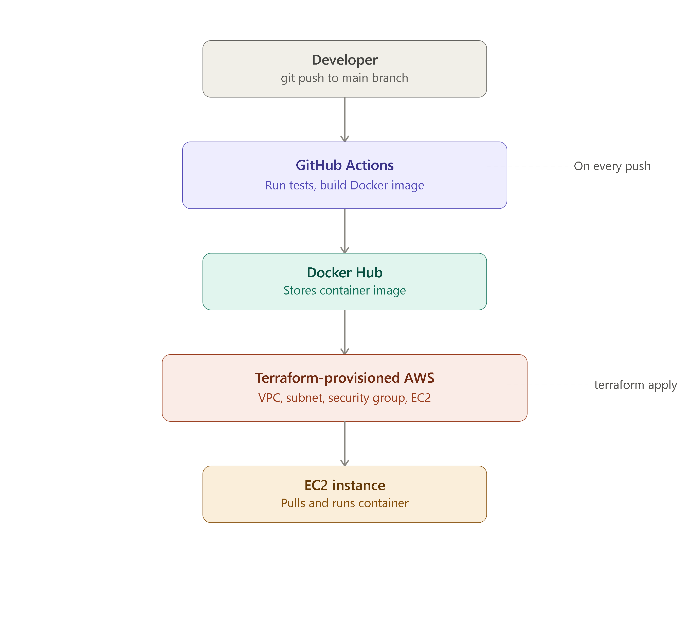

<<<<<<< HEAD
# DevOps Portfolio Project 1 — Task API with Full CI/CD & IaC

A small task-management REST API used to demonstrate an end-to-end DevOps workflow:
containerization, automated CI/CD, and infrastructure-as-code deployment to AWS.

## Architecture

```
Developer push → GitHub Actions (test → build → push image)
                                      ↓
                          Docker Hub (image registry)
                                      ↓
                Terraform-provisioned AWS EC2 (pulls & runs container)
```


## Tech Stack

- **App**: Node.js + Express (REST API)
- **Testing**: Jest + Supertest
- **Containerization**: Docker (multi-stage build, non-root user, health check)
- **CI/CD**: GitHub Actions (test → build → push → deploy notification)
- **Infrastructure as Code**: Terraform (VPC, subnet, security group, EC2)
- **Cloud**: AWS

## Project Structure

```
.
├── app/
│   ├── server.js          # Express API
│   ├── server.test.js     # Unit tests
│   ├── package.json
│   ├── Dockerfile          # Multi-stage, production-hardened
│   └── .dockerignore
├── terraform/
│   ├── main.tf             # VPC, subnet, security group, EC2 instance
│   ├── variables.tf        # Configurable inputs
│   ├── outputs.tf          # Public IP / app URL outputs
│   └── terraform.tfvars.example
└── .github/workflows/
    └── ci-cd.yml            # Test → Build → Push → Deploy pipeline
```

## API Endpoints

| Method | Endpoint | Description |
|--------|----------|-------------|
| GET | `/health` | Health check (used by Docker HEALTHCHECK and load balancers) |
| GET | `/tasks` | List all tasks |
| POST | `/tasks` | Create a new task (`{ "title": "..." }`) |

## Run Locally

```bash
cd app
npm install
npm test        # run unit tests
npm start        # runs on http://localhost:3000
```

## Run with Docker

```bash
cd app
docker build -t devops-portfolio-api .
docker run -p 3000:3000 devops-portfolio-api
```

## CI/CD Pipeline

On every push to `main`, GitHub Actions:
1. Installs dependencies and runs the Jest test suite
2. If tests pass, builds a Docker image
3. Pushes the image to Docker Hub
4. Triggers a deploy step (placeholder — can be extended to SSH into EC2, update ECS, or run `terraform apply`)

Requires these GitHub repo secrets: `DOCKERHUB_USERNAME`, `DOCKERHUB_TOKEN`.

## Deploy Infrastructure with Terraform

```bash
cd terraform
cp terraform.tfvars.example terraform.tfvars
# edit terraform.tfvars with your AMI ID, key pair name, and Docker image

terraform init
terraform plan
terraform apply
```

This provisions a VPC, public subnet, security group, and an EC2 instance that
automatically pulls and runs the Docker image on boot via `user_data`.

Output gives you the public IP and app URL.

## Clean Up

```bash
terraform destroy
```

## Notes

This project is intentionally scoped small so the full pipeline (test → containerize →
CI/CD → cloud provisioning) is easy to read end-to-end — it's built as a portfolio piece
to demonstrate the workflow, not a production system with a full monitoring/logging stack.
=======
# devops-cicd-terraform-demo
End-to-end DevOps demo: Node.js API containerized with Docker, deployed via GitHub Actions CI/CD, with AWS infrastructure provisioned using Terraform.
>>>>>>> a825616404a7dcf8a5bdccfcab87fd63745e676a
